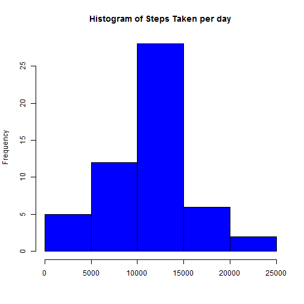
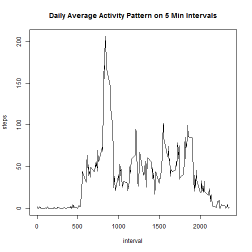
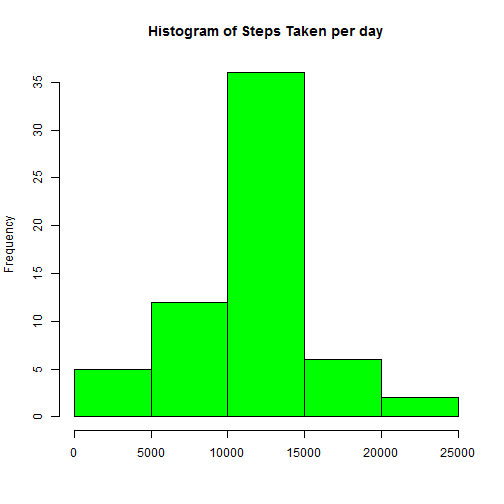
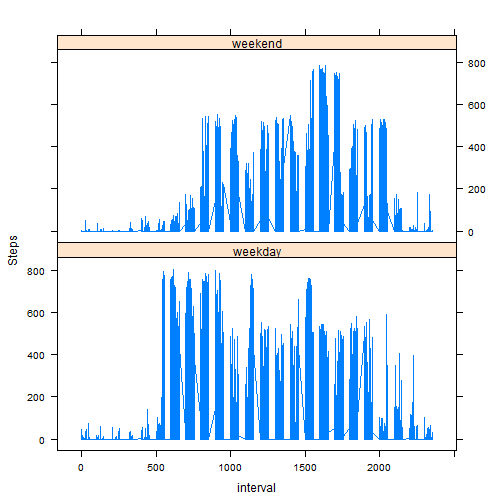

Reproducible Research: Peer Assessment 1
===========================================
Tim Gaertner


**Loading and Processing the Data:**

```r
data <- read.csv(file = ".\\activity.csv")
data$date <- as.Date(data$date)
```

Calculating the mean total number of steps taken per day:

```r
completeSteps <- data[which(!is.na(data$steps)),]
sumSteps <- aggregate(data = completeSteps, steps ~ date, FUN = "sum")
```

Histogram of Steps taken per day:

```r
hist(sumSteps$steps, col = "blue", main = "Histogram of Steps Taken per day", xlab = "")
```

 

Calculating and reporting the mean and median of steps each day:

```r
mean(sumSteps$steps)
```

```
## [1] 10766.19
```

```r
median(sumSteps$steps)
```

```
## [1] 10765
```

**Observing the daily average activity pattern:**

```r
intervalSteps <- aggregate(data = completeSteps, steps ~ interval, FUN = "mean")
with(intervalSteps, plot(x = interval, y = steps, type = "l", main = "Daily Average Activity Pattern on 5 Min Intervals"))
```

 

**Imputing missing values:**

Total number of missing values in the dataset:

```r
nrow(data[which(is.na(data$steps)),])
```

```
## [1] 2304
```

Replacing missing values with average steps in that interval:

```r
imputeData <- merge(data, intervalSteps, by.x = "interval", by.y = "interval")
imputeData$steps.x[which(is.na(imputeData$steps.x))] <-imputeData$steps.y[which(is.na(imputeData$steps.x))]
```

Calculating the mean total number of steps taken per day from imputed data:

```r
sumSteps <- aggregate(data = imputeData, steps.x ~ date, FUN = "sum")
```

Histogram of Steps taken per day from imputed data:

```r
hist(sumSteps$steps.x, col = "green", main = "Histogram of Steps Taken per day", xlab = "")
```

 

Calculating and reporting the mean and median of steps each day from imputed data:

```r
mean(sumSteps$steps.x)
```

```
## [1] 10766.19
```

```r
median(sumSteps$steps.x)
```

```
## [1] 10766.19
```

**Observing activity patterns between weekdays and weekends:**

```r
imputeData$wd <- weekdays(imputeData$date)
imputeData$wd[which(imputeData$wd %in% c("Monday","Tuesday","Wednesday","Thursday","Friday"))] <- "weekday"
imputeData$wd[which(imputeData$wd %in% c("Sunday","Saturday"))] <- "weekend"

library(lattice)
xyplot(steps.x ~ interval | wd, data = imputeData, type = "l", layout = c(1,2), ylab = "Steps")
```

 
